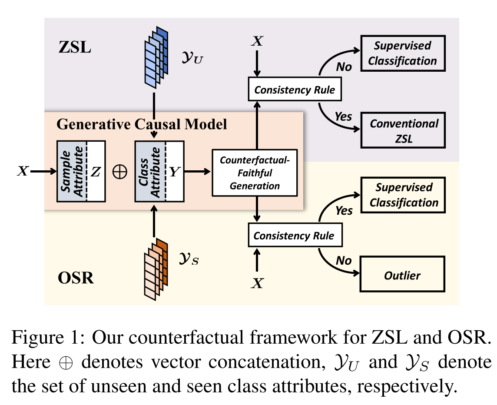
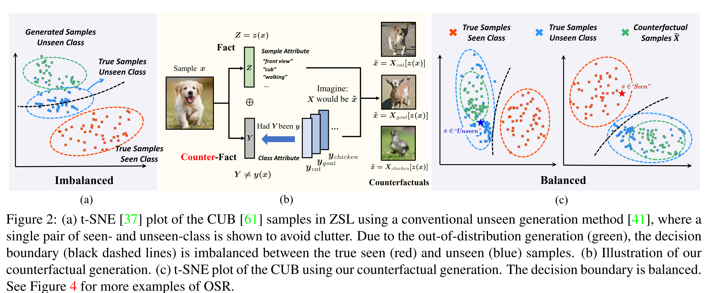
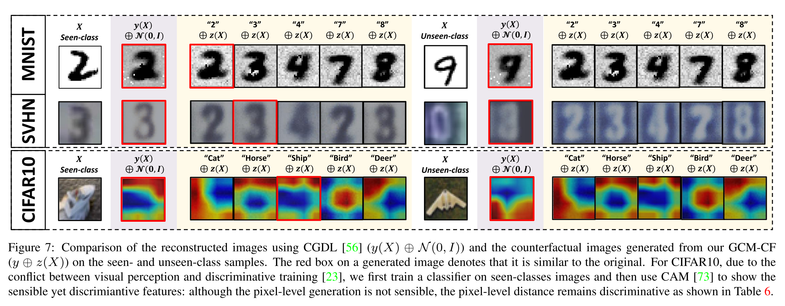
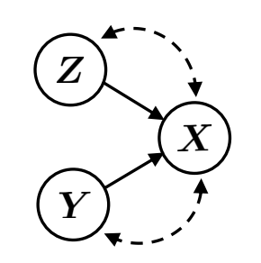
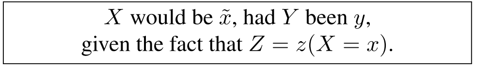

# Counterfactual Zero-Shot and Open-Set Visual Recognition 阅读笔记

## 泛读

### 1. Abstract

Key words: Conterfactual Framework、Zero-shot Learning、Open-Set Recognition

一个基本观点：生成的 unseen 样本和该类别真实分布有所差异，导致 seen-class 和 unseen-class 之间样本不均衡。

由此作者称之前的 generation 是不 **Counterfactual Faithful** 的，从而提出了一个新的生成方法，基于一个反事实问题：*What would the sample look like, if we set its class attribute to a certain class, while keeping its sample attribute unchanged?*

即把类别换成另一个确定的类别，但其他属性不变，观察是否样本看起来发生了变化。

此处提到了两个属性，class attribute 和 sample attribute。

解决了generation问题后，作者提出了Consistency Rule来执行 unseen/seen 的二分类问题，通过第二个反事实问题：*Would its counterfactual still look like itself?* 如果回答是 yes 则进行传统的ZSL分类，否则进行有监督学习。

代码：[github](https://github.com/yue-zhongqi/gcm-cf)

### 图表

模型框架：

大体上是通过 X 得到 sample attribute Z，然后通过两个任务得到各自的 class attribute Y，拼接Z、Y后再生成，然后输入Consistency Rule模块进行二分类，然后输入不同的学习模块进行处理。

问题说明以及解决方案：

Problem：从(a)中可以看出，传统ZSL算法生成的Unseen样本会脱离真实的Unseen样本分布，导致最后学出来的分类器（虚线）横跨在了真实UnSeen样本分布之间，导致分类困难。

从图(b)本文的生成过程上看似乎是先将样本分解成代表 sample attribute 的向量Z以及 class attribute 的向量Y，然后在合成新的样本。

图(c)是本文方法最终达成的效果图，从图上看生成的Unseen样本包裹着真实的Unseen样本，最终的学习出来的分类器效果也比较好。

效果图：

最终模型的效果图，可观察到不同 class attribute 和 sample attribute 结合后产生了类似风格的样本，但都能从 Unseesn 样本上提取出无关类别的信息。

### 结论

本文提出了一个基于反事实的因果生成模型，解决了样本生成不平衡的问题。

## 精读

### About ZSL

ZSL通常有两种settings，第一种是 Conventional ZSL（评估的时候只用unseen样本），第二种是 Generalized ZSL（评估的时候包括seen和unseen样本），论文采用后者。

在训练期间，数据集会提供 class attribute，包括了seen和unseen样本，然后训练生成模型 $P_\theta(X|Z,Y)$，在testing阶段会用没有任何知识的正态分布作为Z的先验概率分布（显然这不可避免地会带来一些偏差），生成 unseen 样本，然后再和数据集中的 seen 样本共同训练一个分类器，再评估该分类器。

### GCM

本文构造的因果图：

实现表示因果图，Z 表示 class attribute，Y 表示 sample  attribute，样本 X 由 Z 和 Y 共同决定。

论文里作者说Z->X、Y->X会被confound，按照我理解的是上图说明的是一个生成过程，如果是推断过程就是X->Z、X->Y，就是标准的fork结构，如果X选择得不是很好的话，就会导致学出来的Z和Y的分布与真实分布不一致，从而导致再利用Z和Y生成的X会偏离真实的分布。

论文里说提出的 GCM 蕴含了**生成**和**推断**两个部分，生成X的时候是利用 $P_\theta(X|Z,Y)$ 这个条件概率，利用X推断Z和Y的时候利用 $Q_\Phi(Z|X)$ 和 $Q_\Psi(Y|X)$ 这两个后验概率。

### Counterfactual Generation and inference

论文提到了一个反事实的概念，就是如果 sample attribute 仍旧是给定样本的，但 class attribute 是另一个类别的，那么生成的样本是什么样的：

形式化为：

$$
\tilde{x}=X_y[z(x)]
$$